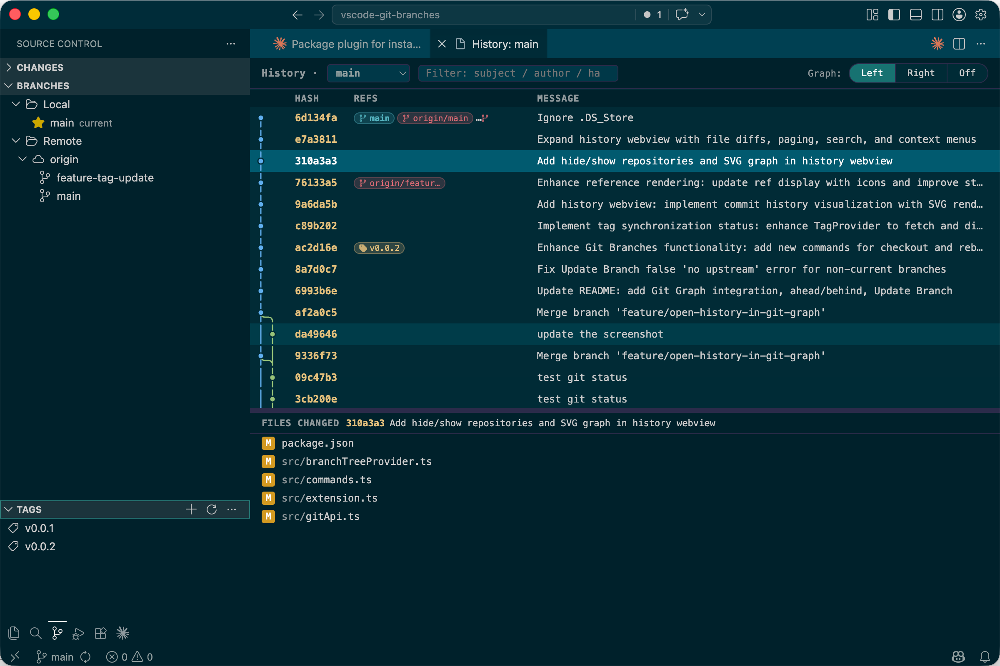

# Git Branches

A VS Code extension that adds dedicated **Branches** and **Tags** panels to the Source Control sidebar, plus a built-in **branch history viewer** with a side-by-side commit graph, file diff, and pagination — inspired by the branch management UI in IntelliJ IDEA.

## Features



### Branches Panel

Displays local and remote branches together in a single tree, grouped by scope:

```
▼ BRANCHES
  ▼ Local
      ★ main (current)  ↑2 ↓1
        feature/login   ↑3
        fix/typo
  ▼ Remote
    ▼ origin
        main
        feature/login
```

**Current branch** is pinned to the top with a star icon. **Remote branches** are grouped under their remote name.

#### Local branch actions (right-click)

| Action | Description |
|--------|-------------|
| Checkout | Switch to this branch |
| Create Branch from Here | Create and checkout a new branch from this one |
| Compare with Current | Open a diff between this branch and the current branch |
| Merge into Current | Merge with strategy picker: **Merge** (commit), **Squash and Merge**, or **No Fast-Forward** |
| Rebase onto This Branch | Rebase current branch onto this one |
| Checkout and Rebase onto Current | Switch to this branch and rebase it onto the (previously) current branch |
| Cherry-pick Tip Commit | Cherry-pick the latest commit of this branch |
| Push | Push to its upstream remote (auto-detected or prompted) |
| Set Upstream | Set the tracking remote branch |
| Rename Branch | Rename in-place |
| Delete Branch | Delete locally (offers force-delete if not fully merged) |
| Update Branch | Pull latest changes from upstream (`git pull` for current branch, fast-forward fetch for others) |
| View History | Open the built-in history viewer (see [History viewer](#history-viewer)) |

#### Remote branch actions (right-click)

| Action | Description |
|--------|-------------|
| Checkout (Create Tracking Branch) | Create a local tracking branch |
| Compare with Current | Open a diff between this remote branch and the current branch |
| Pull into Current Branch... | Pull this remote branch into the current branch with strategy picker (merge / rebase / squash) |
| Fetch | Fetch the latest state of this branch |
| Cherry-pick Tip Commit | Cherry-pick the latest commit |
| Delete Remote Branch | Delete on the remote (offers prune if already gone) |
| View History | Open the built-in history viewer |

#### Local group actions (right-click on "Local")

| Action | Description |
|--------|-------------|
| Create Branch | Create a new branch from current HEAD |
| Stash Changes | Stash uncommitted changes (includes untracked) |
| Pop Stash | Pop the latest stash |
| Apply Stash... | Pick and apply a stash |
| Drop Stash... | Pick and drop a stash |

#### Remote group actions (right-click on "Remote" or a remote name)

| Action | Description |
|--------|-------------|
| Fetch All | Fetch all remotes |

### Tags Panel

Lists all local tags alphabetically, with a sync status indicator for each tag:

| Indicator | Meaning |
|-----------|---------|
| (no badge) | Tag exists locally and on remote, pointing at the same commit |
| `↑ not pushed` (yellow) | Local-only tag, not yet pushed to remote |
| `⚠ conflict` (red) | Local and remote point at different commits |

Sync status is fetched in the background after the view opens; remote unreachable means no indicator is shown (rather than treating every tag as unpublished).

#### Tag actions (right-click)

| Action | Description |
|--------|-------------|
| Checkout Tag | Checkout in detached HEAD mode |
| Push Tag | Push to a remote |
| Delete Tag | Delete locally |

#### Toolbar (Tags panel)

| Button | Description |
|--------|-------------|
| Create Tag | Create a lightweight or annotated tag at current HEAD |
| Refresh | Refresh the tags list |

### Toolbar (Branches panel)

| Button | Description |
|--------|-------------|
| Create Branch | Create a new branch from current HEAD |
| Refresh | Refresh the branches list |

### Ahead / Behind indicator

Local branches with a configured upstream show a sync status next to their name:

| Indicator | Meaning |
|-----------|---------|
| `↑2` | 2 commits ahead of remote |
| `↓3` | 3 commits behind remote |
| `↑1 ↓2` | Diverged — both sides have unique commits |

The current branch uses live data from VS Code's git state (same source as the status bar). Other branches update after a fetch + refresh.

### History viewer

Selecting **View History** on any branch opens a built-in webview with a two-pane layout: a paginated commit table on top and a "files changed" panel at the bottom.

#### Layout

```
┌────────────────────────────────────────────────────────────────────────┐
│ History · [ feature/login ▼ ]            Graph: (─Left─│─Right─│─Off─) │
├────────────────────────────────────────────────────────────────────────┤
│ Graph  Hash      Refs            Message              Date    Author   │
│  ●     310a3a3   [⎇ HEAD→main]   Add hide/show repo   2d ago  song     │
│  ●     76133a5                   Enhance refs styling 3d ago  song     │
│  ●     9a6da5b                   Add history webview  3d ago  song     │
│  …                                                                     │
│                       [  Load more (200 loaded)  ]                     │
├══════════════════════════════════════════════════════════════════════ │  ← drag splitter
│ FILES CHANGED  76133a5  Enhance reference rendering                    │
├────────────────────────────────────────────────────────────────────────┤
│  [M]  src/                 branchTreeProvider.ts                       │
│  [M]  src/                 commands.ts                                 │
│  [A]  src/                 tagSyncBadge.ts                             │
│  [R]  src/utils/old.ts  →  src/util/renamed.ts                         │
└────────────────────────────────────────────────────────────────────────┘
```

#### Branch dropdown

The branch name after `History ·` is a `<select>` dropdown:

- Defaults to the branch you opened the viewer from
- Lists all local branches alphabetically below
- A `-- ALL --` entry at the bottom shows the entire repo history (equivalent to `git log --all`) — useful for finding commits not on the current branch, locating merge points, or following multiple feature branches in parallel

Switching the dropdown reloads the history from the first page; the file panel resets.

#### Pagination

Histories load **200 commits per page**. A `Load more (N loaded)` button at the bottom of the table fetches the next batch via `git log --skip=N --max-count=200`. When you reach the start of history the button is replaced with `— end of history (N commits) —`. Per-page loading keeps very large repos responsive — the first page is usually under a second even for thousands-of-commits histories.

#### Graph column controls

The leftmost column is an SVG lane graph showing branch topology, color-coded per lane. A pill-shaped switch in the toolbar controls its placement:

| Position | Effect |
|----------|--------|
| **Left** (default) | Graph rendered as first column |
| **Right** | Graph moved to last column — text columns get priority |
| **Off** | Graph hidden entirely |

When the graph would otherwise exceed 200px of width (many parallel branches), the column itself stays at 200px and the SVG inside scrolls horizontally.

Lane positions are computed incrementally across pages, so loading more commits never re-shuffles the graph for already-rendered rows.

#### Commit selection → files changed

Click any commit row to highlight it. The bottom panel populates with the list of files that commit modified (vs. its first parent), with color-coded status badges:

| Badge | Meaning |
|-------|---------|
| `A` (green) | Added |
| `M` (yellow) | Modified |
| `D` (red) | Deleted |
| `R` / `C` (purple) | Renamed / Copied (shows `old → new`) |
| `T` (grey) | File type changed |

For root commits (no parent), all files are shown as `A` against git's empty tree.

#### Click a file → side-by-side diff

Clicking a file row opens VS Code's native diff editor in a new tab:

- **Left** = file content at the parent commit
- **Right** = file content at the selected commit
- **Added** files show an empty left side; **deleted** files show an empty right side
- **Renamed** files diff old path → new path
- Tab title: `path/to/file (shortHash)`, or `old → new (shortHash)` for renames
- The diff editor honors all VS Code diff settings (`diffEditor.renderSideBySide`, `diffEditor.ignoreTrimWhitespace`, etc.)

Content is served by a custom URI scheme (`gitbranches-show:`) that runs `git show <ref>:<path>` on demand. Files that don't exist at a given ref (added or deleted in this commit) return empty content, so the diff renders cleanly without "file not found" errors.

#### Compare any two commits (range diff)

**Cmd-click** (macOS) / **Ctrl-click** (Windows/Linux) a second commit row to switch the file panel from "this commit vs. parent" to "commit A vs. commit B". The two rows stay highlighted; the file panel shows the cumulative diff. Cmd/Ctrl-click again to return to single-commit mode.

#### Search / filter

A search box in the toolbar filters the loaded commits in place — matches on **subject**, **author**, **short hash**, or **full hash**. Non-matching rows are hidden (lane graph remains intact). Press **Esc** to clear.

Filter operates over the commits already loaded; click `Load more` to extend the searchable set.

#### Right-click menus

**On a commit row:**

| Item | Description |
|------|-------------|
| Copy hash / Copy short hash / Copy subject | Copy to clipboard |
| Checkout this commit | Detached-HEAD checkout at this commit |
| Create branch from here… | Prompts for a name, branches from this commit |
| Cherry-pick | Cherry-pick this commit into current branch |
| Revert | Create a revert commit |
| Reset (soft) to here | `git reset --soft` (working tree + index kept) |
| Reset (hard) to here | `git reset --hard` — confirms first (discards uncommitted changes) |
| Open commit in browser | Open the commit page on the remote's web host — auto-detects GitHub, GitLab, Gitee, Bitbucket from the configured `origin` URL |

**On a changed file row:**

| Item | Description |
|------|-------------|
| Show file history | Open a new history panel scoped to just this file (`git log -- <file>`) |

#### Resizable splitter

The horizontal bar between the commit table and the files panel is draggable — pull up to give the files panel more room, pull down to focus on commits. The chosen height is remembered per workspace.

#### Layout persistence

Graph position (Left / Right / Off) and splitter height persist to `workspaceState`, so opening the history viewer next time uses your last layout.

#### Reference badges in commit rows

The "Refs" column shows pill-shaped badges for any refs pointing at that commit:

- `HEAD` and `HEAD → branch` in teal
- Local branches in green
- Remote-tracking branches in red
- Tags in yellow

Each pill is capped at 110px with ellipsis for long names.

### Multi-repo workspace support

When multiple git repositories are open, branches and tags are grouped under repository nodes:

```
▼ BRANCHES
  ▼ frontend
    ▼ Local
        ★ main
    ▼ Remote
      ▼ origin
          main
  ▼ backend
    ▼ Local
        ...
```

#### Hide / show repositories

Repositories you don't actively work in can be hidden from the Branches and Tags views to reduce clutter:

| Action | Where | Effect |
|--------|-------|--------|
| **Hide Repository** | Right-click a repo node, or panel toolbar (overflow menu) | Removes it from both panels (per-workspace, persisted in `workspaceState`) |
| **Show Hidden Repository...** | Panel toolbar (overflow menu) | Quick-pick to re-show one of the hidden repos |
| **Show in Git Branches** | File Explorer → right-click a folder | If the folder is a git repo (even one VS Code's git extension hasn't discovered yet), opens it and adds it to the Branches view |

`Show in Git Branches` also makes sub-folder repositories discoverable — useful for monorepos where nested `.git` directories aren't always picked up automatically.

## Requirements

- VS Code `1.85.0` or later
- The built-in **Git** extension must be enabled
- Git installed and accessible (uses the path configured in `git.path`)

## Installation

### From VSIX (local build)

```bash
git clone https://github.com/your-username/vscode-git-branches.git
cd vscode-git-branches
npm install
npm run compile
npx @vscode/vsce package --allow-missing-repository
code --install-extension vscode-git-branches-0.0.1.vsix
```

Then reload VS Code (`Developer: Reload Window`).

## Development

```bash
npm install       # install dependencies
npm run compile   # build once (esbuild → out/extension.js)
npm run watch     # build in watch mode
npm run typecheck # tsc --noEmit (esbuild does NOT type-check)
```

Press `F5` in VS Code to launch an Extension Development Host.

## How It Works

This extension delegates git operations to the built-in `vscode.git` extension API (v1) wherever possible (`checkout`, `merge`, `push`, `pull`, `fetch`, `createBranch`, `deleteBranch`, `getBranches`, `getRefs`). Operations not exposed by the public API — rebase, cherry-pick, rename, stash, delete remote branch, tag manipulation, `--squash` / `--no-ff` merge strategies, `for-each-ref`, `ls-remote`, paged `git log`, `git show` for diff content — are executed via `child_process.execFile` using the binary at `git.path`.

After each operation the built-in git extension is notified via `git.refresh` so its internal state stays in sync.

The history viewer is a webview with a custom `TextDocumentContentProvider` (scheme `gitbranches-show:`) that serves commit-time file content directly via `git show <ref>:<path>`, bypassing the built-in `git:` scheme to avoid edge cases with non-ASCII paths, nested submodule repos, and missing-at-ref lookups.
